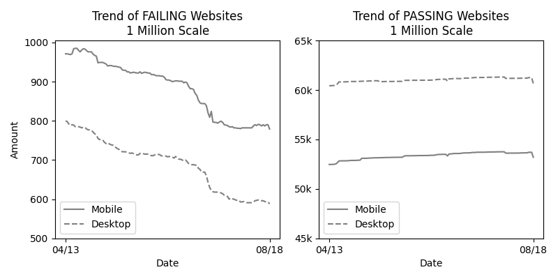
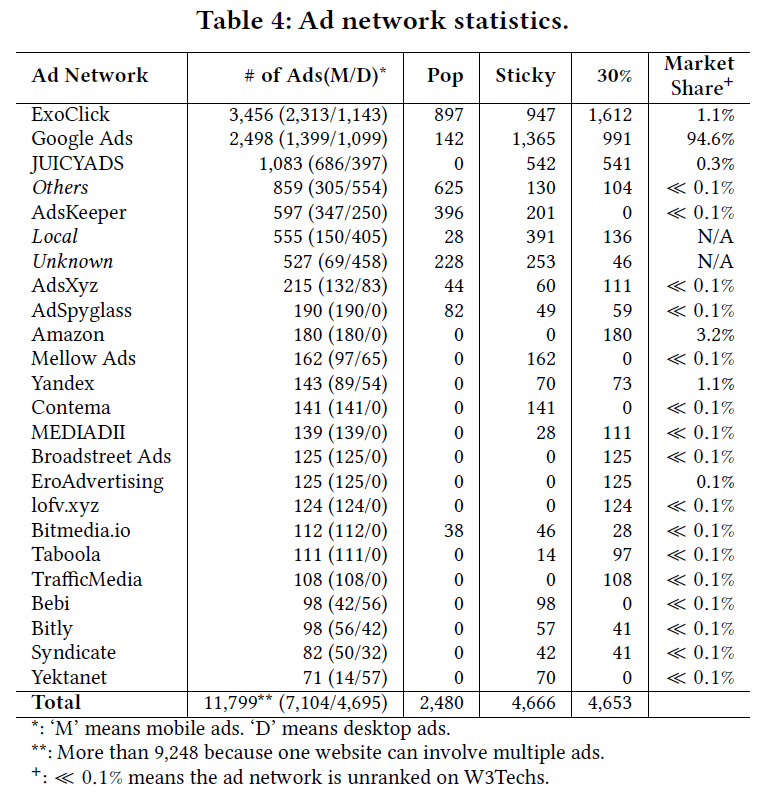
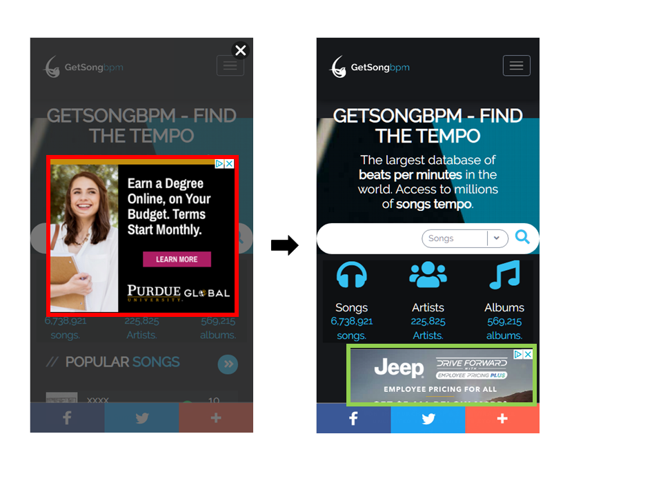

# AdHere

AdHere is an automated framework that assesses compliance with the Better Ads Standards and
helps website developers to detect, pinpoint, and fix the violations.
AdHere can precisely pinpoint ads on the fly and identify participating ad networks. 
It can also provide fix suggestions for developers to either change
ad attributes to comply with the Better Ads Standards or remove
the problematic ads from the page.


## Dataset

Due to the large volume of data, this section only lists 
a small portion of the data generated from our preliminary study and the evaluation of AdHere. 
Specifically, [this folder](https://github.com/adhere-tech/adhere-tech.github.io/tree/master/Data) 
contains the following: 

#### Alexa_result__Sep_10_2020.csv

This file contains Google Ad Experience Report’s result 
of the top 1 million websites on September 10th, 2020.

#### fix_list.csv

This file contains the raw data of violating ad fix time.

#### adhere-partial.csv

This file contains violating ad samples found by AdHere.

#### fix_example/

This folder contains the source code of the fix example on "getsongbpm.com". 
Details about this example can be found [here](adhere-tech.github.io#finding-3-fix-with-attribute-modification---a-case-study).

#### top-1m.csv

This is the Alexa Top 1 Million Websites list.

## Findings

#### Finding 1. Website Coverage


Among the websites being reviewed by Google, the average
number of mobile websites failed daily is 884 while the desktop
version is 690. Moreover, the average numbers of websites passed
daily are 53,353 for mobile and 61,025 for desktop. The above figure shows the
number of sites with the PASSING status and FAILING status from
April 13, 2019 to August 18, 2019.
In general, among those that have been reviewed, we observed a
consistent trend that mobile websites contain more violating
ads than the desktop version. However, the numbers of violating
sites for both platforms are declining.

#### Finding 2. Ad Networks


The above table shows ad network statistics from 13,438 ads collected from
Fail websites marked by AdHere on August 19th, 2020. 
As can be seen, ExoClick, Google Ads, and JUICYADS were the
most prominent ad networks presented the tendency to deliver violating
ads. Note that these top networks delivering violating
ads are not necessarily popular networks. According to the statistics
provided by W3Techs, 71.4% (15 out of 21) of these networks
are unranked and have market share much less than 0.1%.

#### Finding 3. Fix with Attribute Modification - A Case Study

The fix example happens on the mobile website "getsongbpm.com", 
a website telling the bpm (beats per minute) of songs. 
The following figure shows how a violating ad was fixed.
The screenshot on the left shows the web page before the fix 
and the screenshot on the right shows the page after the fix. 
The red square on the left highlights a Pop-up Ad that blocks interactions with other elements. 
Based on the Better Ads Standards, this Pop-up Ad is violating the standards. 
A normal ad was used to fix the violation. 
The green square on the right shows that the Pop-up was replaced by a normal ad. 



The code snippets of the page before and after the fix are shown below. 
[The complete source code of the two version can be found here.](https://github.com/adhere-tech/adhere-tech.github.io/tree/master/Data/fix_example)  

Code snippet of Pop-up Ad (line numbers are positions in the source file):
```
   1    <html><body>...
5694    <!--ADHERE: pop-up ad starts. You can find this comment at line 5694 in file-->
5695    <div id="aic-root-container-250">...
5697        <iframe id="aic-frame-66">...
5700            <html><body><div><div>...
5930                <div id="ad_unit">
5931                    <div class="GoogleActiveViewElement">...
5938                        <div class="GoogleCreativeContainerClass">
                                <!--ADHERE: ad image. You can find this comment at line 5938 in file-->
5938                            <a target="_blank" src="https://s0.2mdn.net/simgad/..." alt="Advertisement"></a>
                            </div>
                        </div>
                    </div>
                </div></div></body></html>
            </iframe>
        </div>...
6322    <!--ADHERE: pop-up ad ends. You can find this comment at line 6322 in file-->
        </body></html>
```

Code snippet of the normal ad:
```
   1    <html><body>...
4712    <section id="content">...
4752        <div class="container"><div>...
4754            <!--ADHERE: normal ad starts. You can find this comment at line 4754 in file-->
4755            <div class="leadboard addmt"><div>...
4772                <div id="google_ads_iframe_/53015287/getsongbpm.com_m_300x250_1_0__container__">...
4774                    <iframe id="google_ads_iframe_/53015287/getsongbpm.com_m_300x250_1_0">...
4780                        <html><body><div>...
5587                            <div id="google_image_div">...
5588                                <a href="https://www.googleadservices.com/pagead/..." target="_blank">
5590                                    <amp-img>...
                                            <!--ADHERE: ad image hosted on Google Ads. You can find this comment at line 5594 in file-->
5594                                        
                                        </amp-img>
                                    </a>
                                </div>
                            </div></body></html>
                        </iframe>
                    </div>
                </div></div>...
6035            <!--ADHERE: normal ad ends. You can find this comment at line 6035 in file-->
            </div></div>
        </section></body></html>
```
