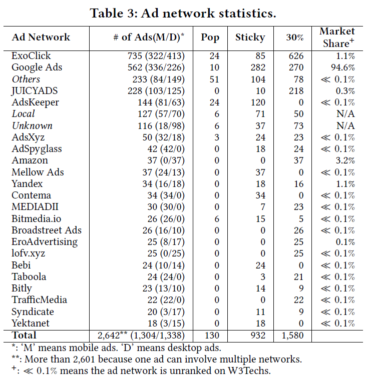

# AdHere

AdHere is an automated framework that assesses the compliance with the Better Ads Standards and
helps website developers to detect, pinpoint and fix the violations.
AdHere can precisely pinpoint ads on the fly and identify participating ad networks. 
It can also provide fix suggestions for developers to either change
ad attributes to comply with the Better Ads Standards or remove
the problematic ads from the page.

This repository contains the source code of AdHere, 
the script used for the preliminary study, and the dataset. 

AdHere is fully tested on Windows 10. 
The Preliminary Study Toolset is used to get the compliance status from Google Ad Experience Report.
  
## Dependencies
- Python 3 (recommended >= 3.7)  
- Python3 libraries: Selenium, lxml, wmi, pywin32, requests
- Google Chrome (recommended >= 79) 
- [ChromeDriver](https://chromedriver.chromium.org/), version corresponding to Chrome version and OS

## Setup Instructions
Before deployment, please first download 
the source code [here](https://github.com/adhere-tech/adhere-tech.github.io/tree/master/SourceCode).
#### AdHere
1. Install Python 3.
2. Install Selenium with `pip install selenium`, lxml with `pip install lxml`, 
wmi with `pip install wmi`, pywin32 with `pip install pywin32`, and requests with `pip install requests`.
3. Based on the OS and Chrome version, 
download the corresponding version of Chromedriver [here](https://chromedriver.chromium.org/). 
Unzip the downloaded file and put `chromedriver.exe` in the same folder as `AdHere.py`.
4. Fill Google Chrome's user profile directory after `USRPROFILE = ` in `AdHere.py`.
5. Run `python AdHere.py domain_url` in the command line to run AdHere on the given URL. 
Leaving `domain_url` blank will perform a self-inspection on google.com.
It will scan the website with the headless (no GUI) Google Chrome. After finishing the scan,
AdHere will generate `violations.txt` in the same folder as `AdHere.py`. 
The text file contains violations (i.e., the id, violation type, and XPath) and their fix suggestions.
    
#### Preliminary Study Toolset
1. Install all [dependencies](adhere-tech.github.io#dependencies).
2. Create at least one project using Google Ad Experience Report API in Google Developer Console. 
3. Apply for the API key for each project. Fill them in `API_KEY_LIST` in `google.py`. 
Adjust `THREAD_COUNT` based on the comments in `google.py`.
4. Run `python google.py` in the terminal to get Google Ad Experience Report's result of Alexa top 1 million websites.
Make sure the network connection is stable.
5. In the generated files,`[R]Alexa_done [XX_XX].csv` is the raw file to be stored in the database. 
It records the compliance status of the 1 million websites.

## Datasets

[Explanations about the datasets can be found here](Data/DataInstruction.md).

## A Glance at Results

### Finding 1. Website Coverage


Among the websites being reviewed by Google, the average
number of mobile websites failed daily is 884 while the desktop
version is 690. Moreover, the average numbers of websites passed
daily are 53,353 for mobile and 61,025 for desktop. The above figure shows the
number of sites with the PASSING status and FAILING status from
April 13, 2019 to August 18, 2019.
In general, among those that have been reviewed, we observed a
consistent trend that mobile websites contain more violating
ads than the desktop version. However, the numbers of violating
sites for both platforms are declining.

### Finding 2. Ad Networks


The above table shows ad network statistics from 2,714 ads collected from
Fail websites marked by AdHere on August 19th, 2020. 
As can be seen, ExoClick, Google Ads, and JUICYADS were the
most prominent ad networks presented the tendency to deliver violating
ads. Some ad networks fail almost exclusively on one particular
ad type. For example, 85.2% of violating ads delivered by ExoClick
are Ad Density Higher Than 30%, and 95.6% from JUICYADS are
Large Sticky Ads. Note that these top networks delivering violating
ads are not necessarily popular networks. According to the statistics
provided by W3Techs, 72.7% (16 out of 22) of these networks
are unranked and have market share much less than 0.1%.

### Finding 3. Fix with Attribute Modification - A Case Study

The screenshot on the left shows the web page before the fix 
and the screenshot on the right shows the page after the fix. 
The red square on the left highlights a Pop-up Ad that blocks interactions with other elements. 
Based on the Better Ads Standards, this Pop-up Ad is violating the standards. 
A normal ad was used to fix the violation. 
The green square on the right shows that the Pop-up was replaced by a normal ad. 


The code snippets of the page before and after the fix are shown below. 
[The complete source code of the two version can be found here.](https://github.com/adhere-tech/adhere-tech.github.io/tree/master/Data/fix_example).  

Code snippet of Pop-up Ad (line numbers are positions in the source file):
```
   1    <html><body>...
5694    <!--ADHERE: pop-up ad starts. You can find this comment at line 5694 in file-->
5695    <div id="aic-root-container-250">...
5697        <iframe id="aic-frame-66">...
5700            <html><body><div><div>...
5930                <div id="ad_unit">
5931                    <div class="GoogleActiveViewElement">...
5938                        <div class="GoogleCreativeContainerClass">
                                <!--ADHERE: ad image. You can find this comment at line 5938 in file-->
5938                            <a target="_blank" src="https://s0.2mdn.net/simgad/..." alt="Advertisement"></a>
                            </div>
                        </div>
                    </div>
                </div></div></body></html>
            </iframe>
        </div>...
6322    <!--ADHERE: pop-up ad ends. You can find this comment at line 6322 in file-->
        </body></html>
```

Code snippet of the normal ad:
```
   1    <html><body>...
4712    <section id="content">...
4752        <div class="container"><div>...
4754            <!--ADHERE: normal ad starts. You can find this comment at line 4754 in file-->
4755            <div class="leadboard addmt"><div>...
4772                <div id="google_ads_iframe_/53015287/getsongbpm.com_m_300x250_1_0__container__">...
4774                    <iframe id="google_ads_iframe_/53015287/getsongbpm.com_m_300x250_1_0">...
4780                        <html><body><div>...
5587                            <div id="google_image_div">...
5588                                <a href="https://www.googleadservices.com/pagead/..." target="_blank">
5590                                    <amp-img>...
                                            <!--ADHERE: ad image hosted on Google Ads. You can find this comment at line 5594 in file-->
5594                                        
                                        </amp-img>
                                    </a>
                                </div>
                            </div></body></html>
                        </iframe>
                    </div>
                </div></div>...
6035            <!--ADHERE: normal ad ends. You can find this comment at line 6035 in file-->
            </div></div>
        </section></body></html>
```
